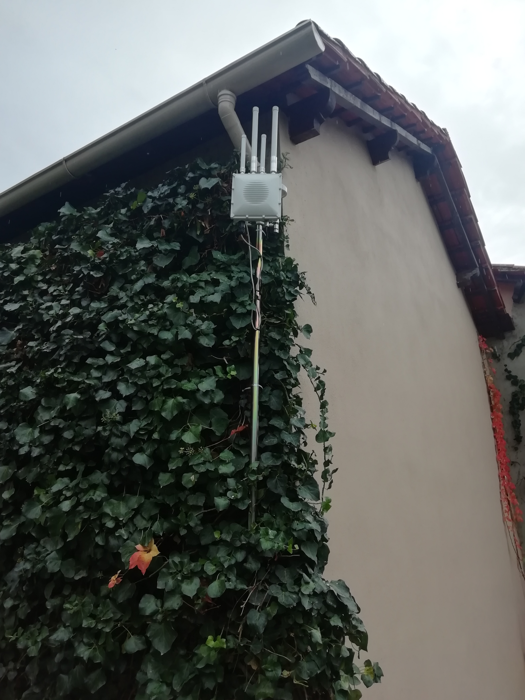
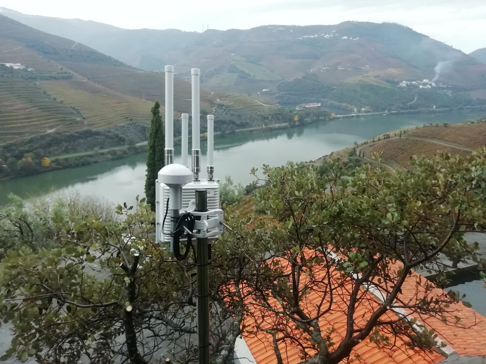
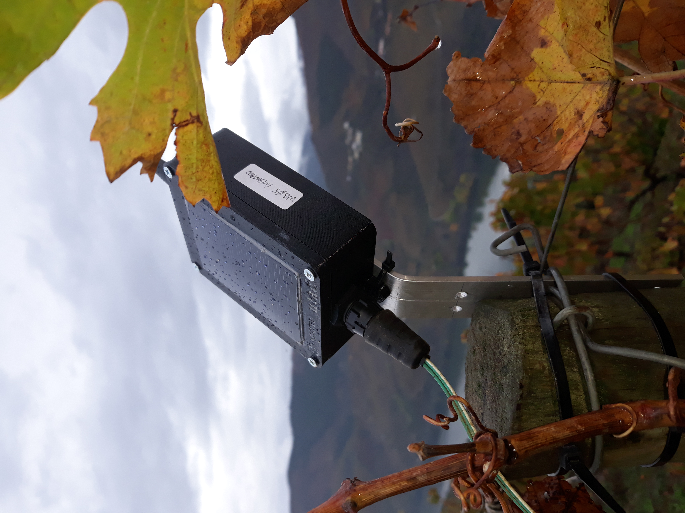
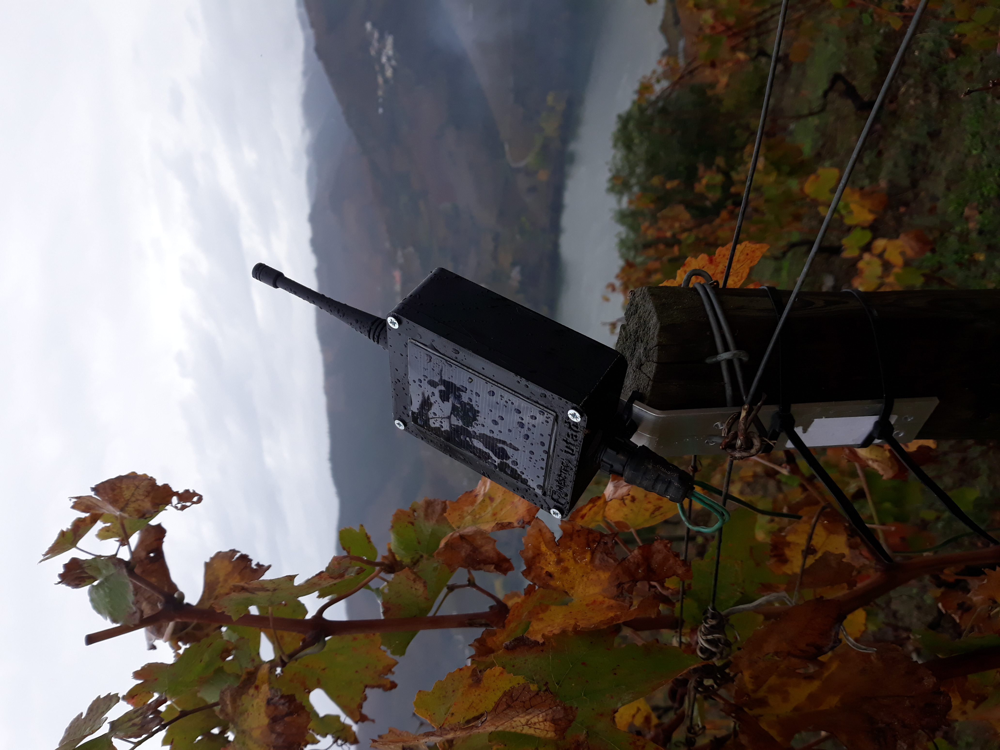
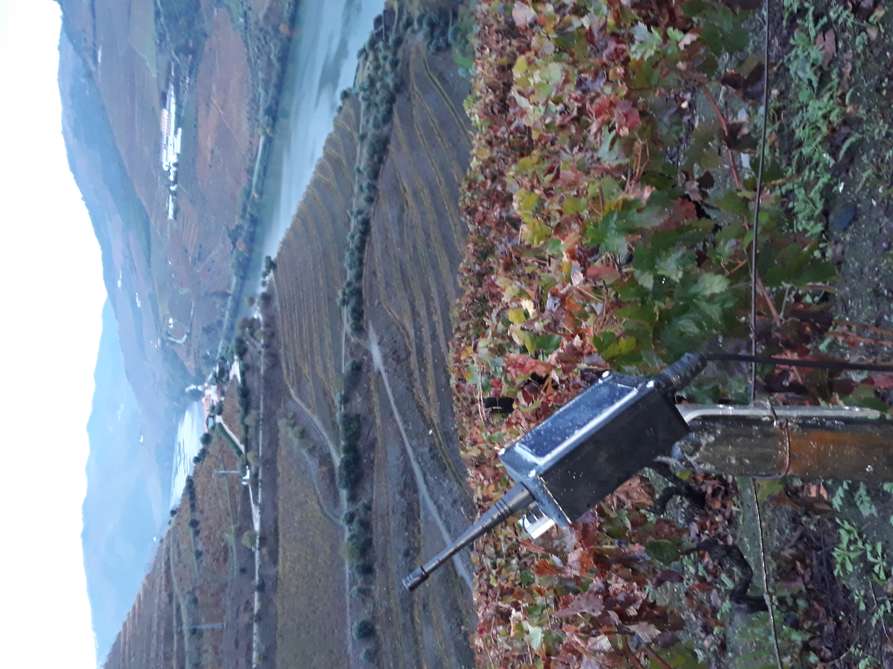
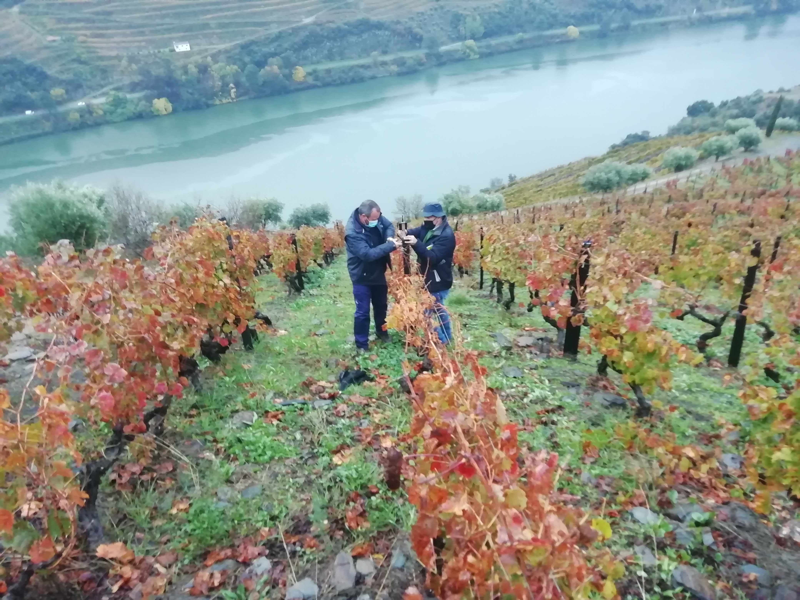

O Projeto
=====================

O projeto piloto demonstrador das potencialidades de uma rede de comunicações, teve como base uma rede de comunicações Low-Power Wide-Area Network (LPWAN) baseada no protocolo [LoRaWAN](https://lora-alliance.org/about-lorawan). 

A especificação LoRaWAN® é um protocolo de rede de baixa potência e para áreas amplas (LPWA) projetado para conectar, sem fios, 'coisas' alimentados por bateria, à internet em redes regionais, nacionais ou globais, e visa os principais requisitos da Internet das coisas (IoT), como serviços de comunicação bi-direcional, segurança ponta a ponta, mobilidade e localização.

## Gateways

Devido às limitações de tempo foi necessário utilizar as três gateways que já possuíamos. Trata-se uma gateway industrial da empresa [RAKWireless](https://www.rakwireless.com/en-us) ([RAK7249](https://www.rakwireless.com/en-us/products/lpwan-gateways-and-concentrators/rak7249)). Esta gateways possui 16 canais, GPS, e GSM/LTE (ligação de dados 4G). No entanto, necessita de ligação à rede elétrica pois ainda não foram adquiridos os paineies solares e baterias.  

Com os requisitos dos locais como sendo a altitude, ligação à rede e alguma abrangência, os locais selecionados para a colocação das três gateways foram: A capela de S. Leonardo da Galafura (excelente local a cerca de 700m de altitude e a capela está eletrificada); a Quinta do Crasto (local onde o grupo já tem projetos em curso); e a Quinta do Seixo (local com alguma altitude e que se situa na margem sul do Rio Douro).

### Gateway Capela de S. Vicente da Galafura

### Gateway Quinta do Seixo

### Gateway Quinta do Crasto

## Módulos Sensores

Os módulos sensores foram desenvolvidos por António Valente ([IoT AgroIntelligence Node](https://github.com/antoniovalente/IoT-AgroIntelligence-Node)). Estes módulo, baseados no [CubeCell Development Board](https://heltec.org/project/htcc-ab01/), podem conter diversos tipos de sensores. Neste projeto foram utilizados os seguintes sensores:

1. [Watermark](https://www.irrometer.com/sensors.html#wm) da Irrometer. Este sensor mede a pressão que a água exerce no solo. 

2. [BME680](https://www.bosch-sensortec.com/products/environmental-sensors/gas-sensors-bme680/) da Bosch. Este sensor mede a temperatura e a humidade do ar, assim como, a pressão atmosférica e pode detectar uma ampla gama de gases, como compostos orgânicos voláteis (VOC).
3. [5TE](https://www.metergroup.com/environment/articles/meter-legacy-soil-moisture-sensors/) da Meter Group. Trata de um sensor do teor de água no solo, a condutividade elétrica do solo (EC - Electrical Conductivity) e temperatura do solo. O 5TE usa um oscilador a 70 MHz para medir a permissividade dielétrica do solo para determinar o conteúdo de água, um termistor em contato térmico com os pinos do sensor fornece a temperatura do solo, enquanto os parafusos na superfície do sensor medem a EC. O sensor tem uma saída digital [SDI-12](http://www.sdi-12.org/). O módulo desenvovido está preparado para sensores SDI-12, pois este protocolo é muito utilizado em sensores para a agricultura.
4. [ATMOS41](https://www.metergroup.com/environment/products/atmos-41-weather-station/) da Meter Group. Trata-se de uma estação meteorológica All-in-One que inclui 12 sensores meteorológicos num único dispositivo compacto para as condições atmosféricas. O ATMOS41 mede a temperatura e humidade do ar, a pressão atmosférica e de vapor, a velocidade (média e máxima num período de tempo) e direção do vento, pluviosidade, radiação solar e o número de relâmpagos e sua distância. O ATMOS41 também comunica os seus dados com o módulo IoT AgroIntelligence por SDI-12.

Foram desenvolvidos nove módulos sensores, quatro com sensores Watermark, três com sensores BME680, um com o sensor 5TE e outro com a estação meteorológica ATMOS41. Os sensores foram distribuídos pelas três quintas do douro da seguinte forma: Quinta do Seixo - dois sensores Watermark e um BME680; Quinta do Infantado - um sensor Watermark e um BME680; Quinta do Crasto - um sensor Watermark, um BME680, um 5TE e a estação ATMOS41. A Quinta do Crasto possuí mais sensores pois já existe um historial de colaborações em projectos em conjunto com a [Altice Labs](https://www.alticelabs.com/pt/444-altice-labs-contribui-para-artigo-cientifico-na-area-de-iot-aplicado-a-vinicultura.html), a [Globaltronic](https://globaltronic.pt/) e a [Geodouro](http://www.geodouro.pt/index.php.

### Quinta do Seixo

### Quinta do Infantado

### Quinta do Crasto

