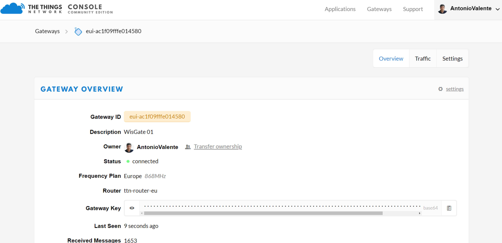

# Resultados

Em todas as três gateways foram colocados cartões GSM/LTE da operadora MEO, com o `apn=internet`. Em seguida foram registadas na consola [TheThingsNetwork](https://console.thethingsnetwork.org/gateways). 

## Exemplo do Registo da Gateway da Galafura

## Estado das Gateways

A gateway da Quinta do Crasto,devido a problemas de cobertura GSM/LTE no local destinado à sua colocação, não se conseguiu conetar à TheThingsNetwork.

## Resultados das Comunicações dos Sensores

Embora a gateway da Quinta do Crasto tenha ficado inoperacional todos os nove sensores conseguiram comunicar. Por exemplo, um sensor da Quinta do Seixo comunicou os seus dados através de três gateways: a gateway instalada na Galafura (dista 9.8 km do sensor), a gateway da própria Quinta do Seixo (menos de 1km) e uma outra gateway desconhecida. 

O panorama das comunicações entre sensores e gateways foi o que se segue:

## Visualização dos Dados

Embora fora do âmbito do projeto, foi desenvolvida uma plataforma para a visualização dos dados, através de um *dashboard* em `Node-Red` num servidor do INESC TEC.

Os dados da Quinta do Crasto no *dashboard* desenvolvido.

## Node-Red

O ficheiro JSON do Node-Red pode ser descarregado [aqui](../node-red/HackathonDouroPorto_Desafio1_NodeRed.json)

