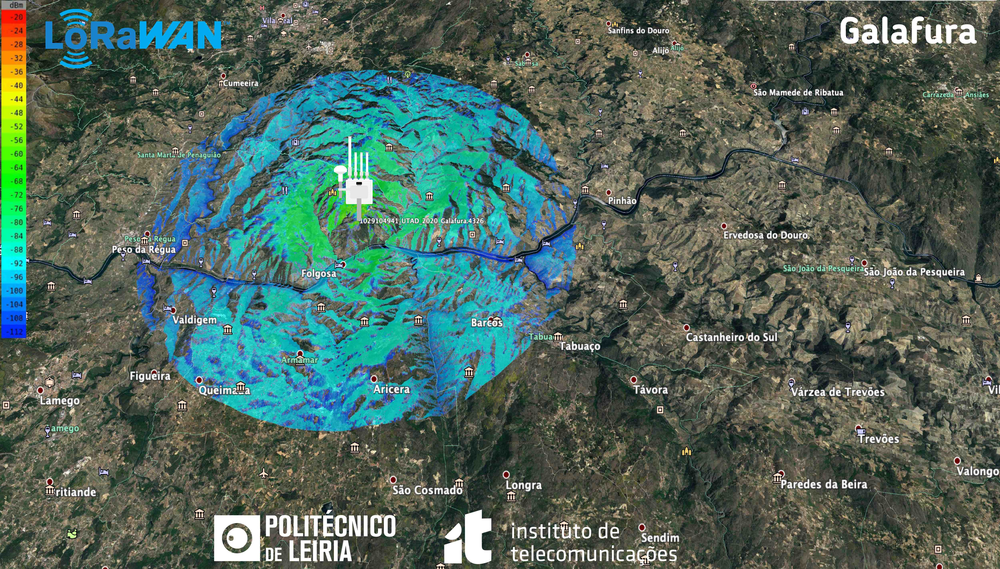
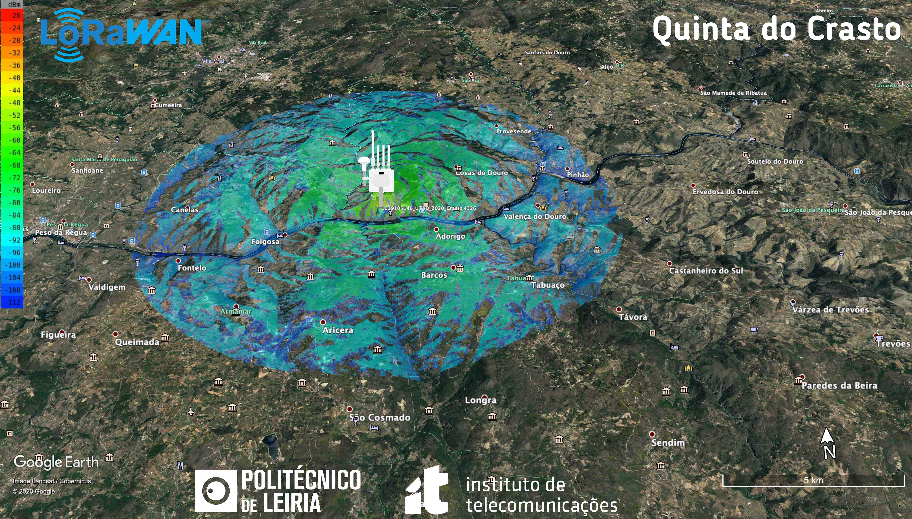
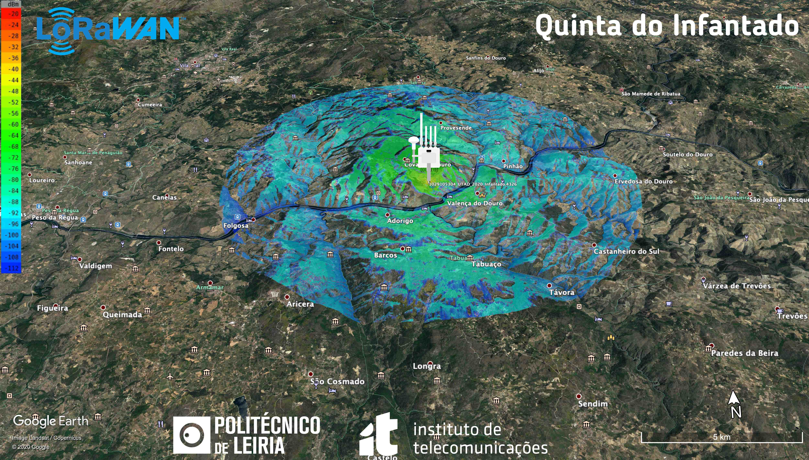
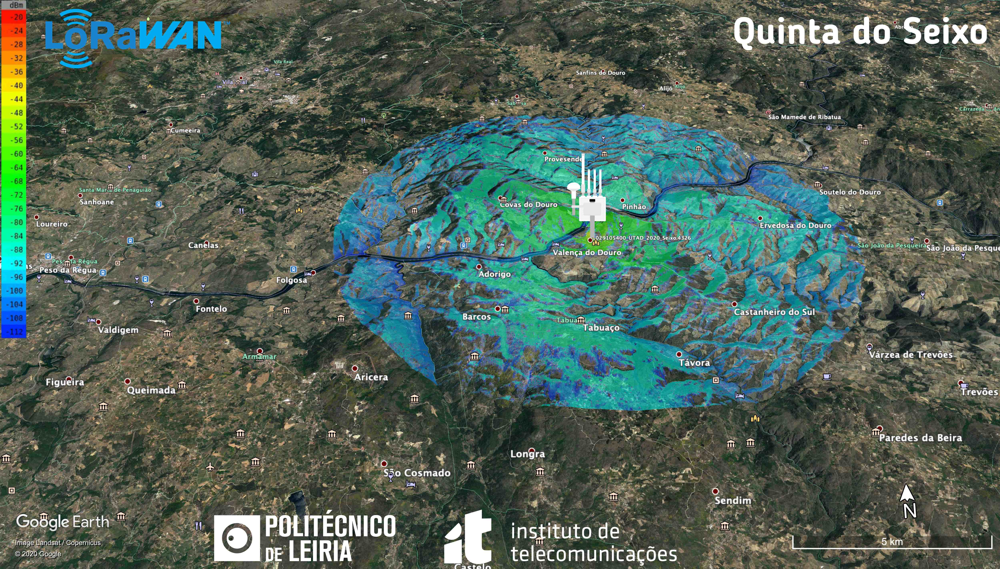
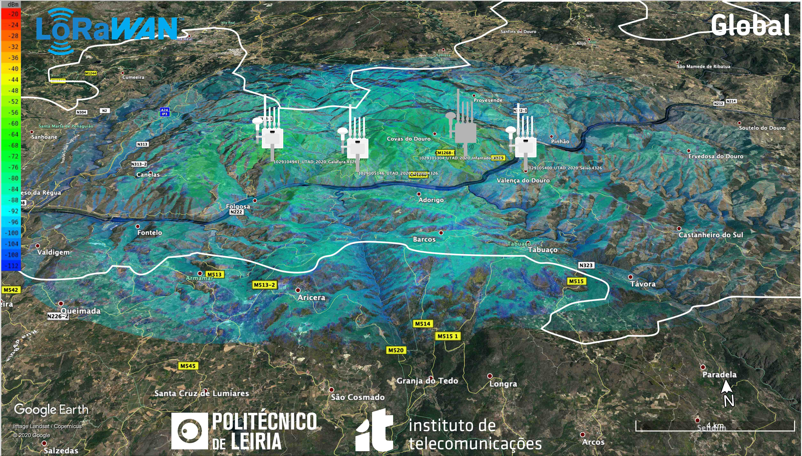

# Simulações

No início do projeto foram considerados quatro locais para a colocação das gateways: Galafura, Quinta do Crasto, Quinta do Seixo e Quinta do Infantado. As simulações foram elaboradas pelo Telmo Fernandes docente no Instituto Politécnico de Leira e investigador no Instituto de Telecomunicações.

## Galafura

## Quinta do Crasto

## Quinta do Infantado

## Quinta do Seixo

## Global

